# Architecture Overview

PentestAI implements a sophisticated two-stage framework for comprehensive security assessment, combining autonomous penetration testing with optimal remediation planning.

## System Architecture

```mermaid
graph TB
    subgraph User Interfaces
        UI1[React Web UI]
        UI2[Interactive CLI]
        UI3[API Client]
        UI4[Gradio UI]
    end
    
    subgraph PentestAI Core
        Controller[PentestAI Controller]
        Config[Configuration Manager]
        Controller --> Stage1[Stage 1: Pentest Module]
        Controller --> Stage2[Stage 2: Remediation Module]
    end
    
    subgraph Stage 1: Pentest Agents
        S1A1[Planner Agent]
        S1A2[Executor Agent]
        S1A3[Instructor Agent]
        S1A4[Summarizer Agent]
        S1A5[Extractor Agent]
        S1A6[Monitor Agent]
        
        Stage1 --> S1A1
        Stage1 --> S1A2
        Stage1 --> S1A3
        Stage1 --> S1A4
        Stage1 --> S1A5
        Stage1 --> S1A6
    end
    
    subgraph Stage 2: Remediation Agents
        S2A1[Estimator Agent]
        S2A2[Advisor Agent]
        S2A3[Evaluator Agent]
        S2A4[Optimizer Agent]
        
        Stage2 --> S2A1
        Stage2 --> S2A2
        Stage2 --> S2A3
        Stage2 --> S2A4
    end
    
    subgraph External Systems
        LLM[LLM Provider<br/>OpenAI/ArvanCloud]
        MCP[Kali MCP Server<br/>Real Tool Execution]
        KB[Knowledge Base<br/>RAG System]
    end
    
    UI1 --> Controller
    UI2 --> Controller
    UI3 --> Controller
    UI4 --> Controller
    
    Stage1 --> LLM
    Stage2 --> LLM
    S1A2 --> MCP
    S1A3 --> KB
    
    style Stage1 fill:#2d3748
    style Stage2 fill:#2d3748
    style Controller fill:#4a5568
    style MCP fill:#742a2a
    style LLM fill:#2c5282
```



## Two-Stage Framework

### Stage 1: Pentest Module

**Purpose**: Autonomous vulnerability discovery through iterative penetration testing

**Workflow**:
1. **Planning Phase**: Planner creates attack plan with counterfactual reasoning
2. **Execution Phase**: Executor generates and runs penetration testing commands
3. **Analysis Phase**: Summarizer condenses outputs, Extractor identifies vulnerabilities
4. **Guidance Phase**: Instructor provides RAG-based recommendations
5. **Monitoring Phase**: Monitor tracks progress and handles errors

**Output**: 
- List of discovered vulnerabilities with CVSS scores
- Attack plan tree showing successful attack paths
- Complete command execution history

### Stage 2: Remediation Module

**Purpose**: Optimal remediation strategy selection using Group Knapsack algorithm

**Workflow**:
1. **Estimation Phase**: Estimator assigns CVSS severity scores
2. **Advisory Phase**: Advisor generates multiple remediation strategies with counterfactual analysis
3. **Evaluation Phase**: Evaluator scores strategies on effectiveness and cost
4. **Optimization Phase**: Optimizer selects optimal subset using Group Knapsack

**Output**:
- Optimal remediation strategies (maximizing effectiveness/cost ratio)
- All proposed strategies with scores
- Vulnerabilities grouped by severity

## Component Architecture

### 1. Controller Layer

The `PentestAIController` is the main orchestrator:

```python
class PentestAIController:
    def __init__(self, config: PentestAIConfig):
        self.config = config
        self.pentest_module = PentestModule(config)
        self.remediation_module = RemediationModule(config)
        self.llm_client = self._init_llm_client()
    
    def run_full_assessment(self):
        # Stage 1: Penetration Testing
        pentest_result = self.pentest_module.run(self.llm_client)
        
        # Stage 2: Remediation Planning
        remediation_result = self.remediation_module.run(
            pentest_result.vulnerabilities,
            self.llm_client
        )
        
        return pentest_result, remediation_result
```

**Responsibilities**:
- Initializes LLM client (OpenAI or ArvanCloud)
- Coordinates two-stage workflow
- Manages configuration and state
- Handles result output and reporting

### 2. Pentest Module

**File**: [pentestai/core/pentest_module.py](../pentestai/core/pentest_module.py)

**Architecture**:
```python
class PentestModule:
    def __init__(self, config):
        self.planner = PlannerAgent()
        self.executor = ExecutorAgent()
        self.instructor = InstructorAgent()
        self.summarizer = SummarizerAgent()
        self.extractor = ExtractorAgent()
        self.monitor = MonitorAgent()
    
    def run(self, llm_client):
        for round in range(self.config.max_rounds):
            # 1. Plan next attack
            plan = self.planner.generate_plan(...)
            
            # 2. Get instruction
            instruction = self.instructor.get_guidance(...)
            
            # 3. Execute command
            command = self.executor.generate_command(...)
            output = self._execute(command)
            
            # 4. Summarize output
            summary = self.summarizer.summarize(output)
            
            # 5. Extract vulnerabilities
            vulns = self.extractor.extract(summary)
            
            # 6. Monitor progress
            should_continue = self.monitor.check(...)
        
        return PentestResult(vulnerabilities, attack_plan)
```

**Key Features**:
- Iterative refinement over multiple rounds
- Counterfactual reasoning in planning
- RAG-based instruction from knowledge base
- Automatic vulnerability extraction
- Progress monitoring and early stopping

### 3. Remediation Module

**File**: [pentestai/core/remediation_module.py](../pentestai/core/remediation_module.py)

**Architecture**:
```python
class RemediationModule:
    def __init__(self, config):
        self.estimator = EstimatorAgent()
        self.advisor = AdvisorAgent()
        self.evaluator = EvaluatorAgent()
        self.optimizer = GroupKnapsackOptimizer()
    
    def run(self, vulnerabilities, llm_client):
        # 1. Estimate severity
        scored_vulns = self.estimator.score(vulnerabilities)
        
        # 2. Group by severity (High/Medium/Low)
        groups = self._group_by_severity(scored_vulns)
        
        # 3. Generate strategies
        all_strategies = []
        for vuln in vulnerabilities:
            strategies = self.advisor.generate_strategies(vuln)
            for s in strategies:
                s.score = self.evaluator.evaluate(s)
            all_strategies.extend(strategies)
        
        # 4. Optimize selection
        selected = self.optimizer.solve(all_strategies, groups)
        
        return RemediationResult(selected, all_strategies, groups)
```

**Key Features**:
- CVSS-based severity estimation
- Multiple remediation strategies per vulnerability
- Effectiveness/cost scoring
- Group Knapsack optimization for optimal selection

### 4. LLM Integration

**File**: [pentestai/llm/client.py](../pentestai/llm/client.py)

**Supported Providers**:

```python
class OpenAIClient:
    """OpenAI API client"""
    def __init__(self, api_key, model="gpt-4"):
        self.client = OpenAI(api_key=api_key)
        self.model = model
    
    def generate(self, messages, temperature=0.7):
        response = self.client.chat.completions.create(
            model=self.model,
            messages=messages,
            temperature=temperature
        )
        return response.choices[0].message.content

class ArvanCloudClient(OpenAIClient):
    """ArvanCloud AI Gateway client"""
    def __init__(self, api_key, model="gpt-4"):
        # ArvanCloud uses OpenAI format with custom base URL
        modified_key = f"apikey {api_key}"  # Add prefix
        super().__init__(modified_key, model)
        self.client.base_url = "https://api.arvancloud.ir/llm/v1"
```

**Features**:
- Streaming support for real-time output
- Token usage tracking
- Automatic retry on failures
- Multi-provider support (OpenAI, ArvanCloud)

### 5. MCP Integration

**File**: [pentestai/mcp/client.py](../pentestai/mcp/client.py)

**Kali MCP Server**:
- Official Kali Linux MCP server package
- Exposes 50+ penetration testing tools
- Runs in Docker container with host network access
- Supports tool discovery and execution

**Client Architecture**:
```python
class MCPClient:
    def __init__(self, server_url="http://localhost:5000"):
        self.server_url = server_url
        self.available_tools = self._discover_tools()
    
    def execute_command(self, command: str):
        """Execute command via MCP server"""
        response = requests.post(
            f"{self.server_url}/execute",
            json={"command": command}
        )
        return response.json()
    
    def _discover_tools(self):
        """List available tools"""
        response = requests.get(f"{self.server_url}/tools/list")
        return response.json()
```

### 6. Knowledge Base

**File**: [pentestai/knowledge/base.py](../pentestai/knowledge/base.py)

**RAG System**:
- 15+ built-in penetration testing patterns
- Contextual guidance for Instructor agent
- Examples: SQL injection, XSS, SSRF, LFI, RCE patterns

**Structure**:
```python
KNOWLEDGE_BASE = {
    "sql_injection": {
        "description": "SQL injection vulnerability testing",
        "tools": ["sqlmap", "nmap --script=sql-injection"],
        "patterns": ["' OR '1'='1", "admin'--", ...],
        "examples": [...]
    },
    "xss": {
        "description": "Cross-site scripting detection",
        "tools": ["xsstrike", "dalfox"],
        "patterns": ["<script>alert(1)</script>", ...],
        "examples": [...]
    },
    ...
}
```

## Data Flow

### Pentest Stage Data Flow

```
Target → Planner → Attack Plan
              ↓
         Instructor → Knowledge Base
              ↓
         Executor → Command
              ↓
         MCP Server → Real Execution
              ↓
         Summarizer → Condensed Output
              ↓
         Extractor → Vulnerabilities
              ↓
         Monitor → Continue/Stop Decision
              ↓
         PentestResult
```

### Remediation Stage Data Flow

```
Vulnerabilities → Estimator → CVSS Scores
                      ↓
                 Grouping → High/Medium/Low
                      ↓
                 Advisor → Remediation Strategies
                      ↓
                 Evaluator → Effectiveness/Cost Scores
                      ↓
                 Optimizer → Group Knapsack Algorithm
                      ↓
                 Selected Strategies
```

## Design Principles

### 1. Modularity
- Each agent is independent and replaceable
- Clear interfaces between components
- Easy to extend with custom agents

### 2. Safety
- Sandbox mode for safe testing
- Isolated Docker execution
- Comprehensive logging and audit trails

### 3. Flexibility
- Multiple LLM providers
- Configurable agent parameters
- Custom knowledge base support

### 4. Observability
- Real-time streaming of agent thoughts
- Complete command history
- Attack plan visualization

### 5. Optimization
- Group Knapsack for optimal remediation
- Counterfactual reasoning for exploration
- Early stopping based on progress

## Technology Stack

**Core Framework**:
- Python 3.9+
- OpenAI API / ArvanCloud Gateway
- Docker & Docker Compose

**Web Interface**:
- React 18 with Vite
- FastAPI backend
- Server-Sent Events (SSE) streaming
- Marked.js for markdown rendering

**Penetration Testing**:
- Kali Linux MCP Server
- 50+ security tools (nmap, sqlmap, metasploit, etc.)
- Model Context Protocol (MCP)

**Algorithms**:
- Group Knapsack optimization
- Counterfactual reasoning
- RAG-based knowledge retrieval

## Performance Characteristics

**Pentest Module**:
- Rounds: Configurable (default 5)
- Time per round: 30-60 seconds (depends on LLM)
- Total time: 2-5 minutes for full assessment

**Remediation Module**:
- Strategies per vulnerability: 3-5
- Optimization time: <1 second (Group Knapsack)
- Total time: 1-2 minutes

**Scalability**:
- Parallel agent execution possible
- Stateless LLM calls
- Horizontal scaling with multiple MCP servers

## Security Considerations

1. **Isolation**: MCP server runs in Docker container
2. **Network**: Host network mode only when needed
3. **Authentication**: API keys stored in environment variables
4. **Audit**: All commands logged with timestamps
5. **Permissions**: Container runs as non-root user

## Next Steps

- **Deep Dive**: Learn about the [Two-Stage Framework](two-stage-framework.md)
- **Agents**: Explore [10 specialized agents](agent-system.md)
- **Configuration**: Customize with [configuration options](core/configuration.md)
- **Deployment**: Set up [production deployment](deployment/production.md)

---

Continue to [Two-Stage Framework](two-stage-framework.md) →
